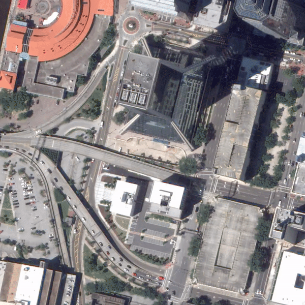

# Satellite Structure from Motion

Maintained by [Kai Zhang](https://kai-46.github.io/website/). 

## Overview
- This is a library dedicated to solving the satellite structure from motion problem.
- It's a wrapper of the [VisSatSatelliteStereo repo](https://github.com/Kai-46/VisSatSatelliteStereo) for easier use.
- The outputs are png images and **OpenCV-compatible** pinhole camreas readily deployable to multi-view stereo pipelines targetting ground-level images.

## Installation
Assume you are on a Linux machine with at least one GPU, and have conda installed. Then to install this library, simply by:
```bash
. ./env.sh
```

## Inputs
We assume the inputs to be a set of .tif images encoding the 3-channel uint8 RGB colors, and the metadata like RPC cameras. 
This data format is to align with the public satellite benchmark: [TRACK 3: MULTI-VIEW SEMANTIC STEREO](https://ieee-dataport.org/open-access/data-fusion-contest-2019-dfc2019).
Download one example data from this [google drive](https://drive.google.com/drive/folders/11UeurSa-dyfaRUIdUZFfNBAyd3jN7D46?usp=sharing); folder structure look like below:


```
- examples/inputs
    - images/
        - *.tif
        - *.tif
        - *.tif
        - ...
    - latlonalt_bbx.json
```
, where ```latlonalt_bbx.json``` specifies the bounding box for the site of interest in the global (latitude, longitude, altitude) coordinate system. 

If you are not sure what is a reasonably good altitude range, you can put random numbers in the json file, but you have to enable the ```--use_srtm4``` option below.  

## Run Structure from Motion
```bash
python satellite_sfm.py --input_folder examples/inputs --output_folder examples/outputs --run_sfm [--use_srtm4] [--enable_debug]
```
The ```--enable_debug``` option outputs some visualization helpful debugging the structure from motion quality.

## Outputs
- ```{output_folder}/images/``` folder contains the png images
- ```{output_folder}/cameras_adjusted/``` folder contains the bundle-adjusted pinhole cameras; each camera is represented by a pair of 4x4 K, W2C matrices that are OpenCV-compatible.
- ```{output_folder}/enu_bbx_adjusted.json``` contains the scene bounding box in the local ENU Euclidean coordinate system.
- ```{output_folder}/enu_observer_latlonalt.json``` contains the observer coordinate for defining the local ENU coordinate; essentially, this observer coordinate is only necessary for coordinate conversion between local ENU and global latitude-longitude-altitude.

If you turn on the ```--enable_debug``` option, you might want to dig into the folder ```{output_folder}/debug_sfm``` for visuals, etc.

## Citations
```
@inproceedings{VisSat-2019,
  title={Leveraging Vision Reconstruction Pipelines for Satellite Imagery},
  author={Zhang, Kai and Sun, Jin and Snavely, Noah},
  booktitle={IEEE International Conference on Computer Vision Workshops},
  year={2019}
}
```

## Example results
### input images

### sparse point cloud ouput by SfM

### homograhpy-warp one view, then average with another by a plane sequence

[high-res video](https://drive.google.com/file/d/13TshDCsHTx0J7X6UFd0zglutQkD8NgyK/view?usp=sharing)
### inspect epipolar geometry
```
python inspect_epipolar_geometry.py
```

### get zero-skew instrincis marix
```
python skew_correct.py --input_folder ./examples/outputs ./examples/outputs_zeroskew
```


## More handy scripts are coming
Stay tuned :-)
