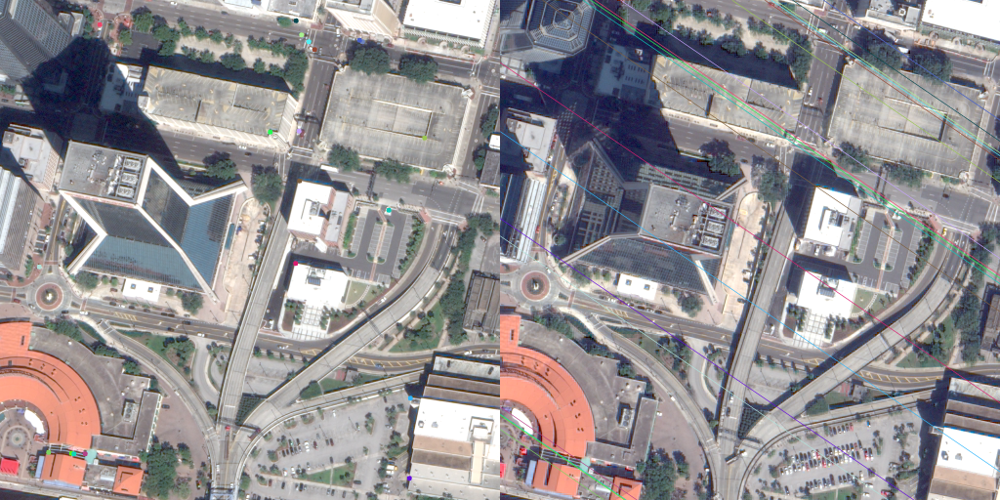
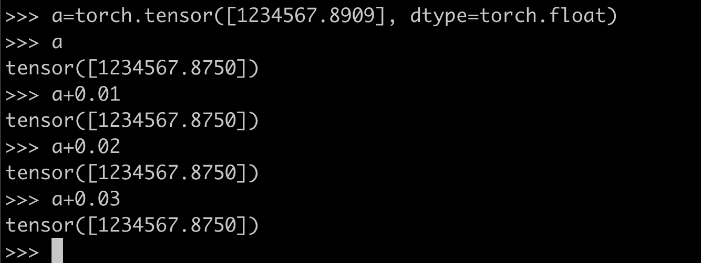

# Satellite Structure from Motion

Maintained by [Kai Zhang](https://kai-46.github.io/website/). 

## Overview
- This is a library dedicated to solving the satellite structure from motion problem.
- It's a wrapper of the [VisSatSatelliteStereo repo](https://github.com/Kai-46/VisSatSatelliteStereo) for easier use.
- The outputs are png images and **OpenCV-compatible** pinhole camreas readily deployable to multi-view stereo pipelines targetting ground-level images.

## Installation
Assume you are on a Linux machine with at least one GPU, and have conda installed. Then to install this library, simply by:
```bash
. ./env.sh
```

## Inputs
We assume the inputs to be a set of .tif images encoding the 3-channel uint8 RGB colors, and the metadata like RPC cameras. 
This data format is to align with the public satellite benchmark: [TRACK 3: MULTI-VIEW SEMANTIC STEREO](https://ieee-dataport.org/open-access/data-fusion-contest-2019-dfc2019).
Download one example data from this [google drive](https://drive.google.com/drive/folders/11UeurSa-dyfaRUIdUZFfNBAyd3jN7D46?usp=sharing); folder structure look like below:


```
- examples/inputs
    - images/
        - *.tif
        - *.tif
        - *.tif
        - ...
    - latlonalt_bbx.json
```
, where ```latlonalt_bbx.json``` specifies the bounding box for the site of interest in the global (latitude, longitude, altitude) coordinate system. 

If you are not sure what is a reasonably good altitude range, you can put random numbers in the json file, but you have to enable the ```--use_srtm4``` option below.  

## Run Structure from Motion
```bash
python satellite_sfm.py --input_folder examples/inputs --output_folder examples/outputs --run_sfm [--use_srtm4] [--enable_debug]
```
The ```--enable_debug``` option outputs some visualization helpful debugging the structure from motion quality.

## Outputs
- ```{output_folder}/images/``` folder contains the png images
- ```{output_folder}/cameras_adjusted/``` folder contains the bundle-adjusted pinhole cameras; each camera is represented by a pair of 4x4 K, W2C matrices that are OpenCV-compatible.
- ```{output_folder}/enu_bbx_adjusted.json``` contains the scene bounding box in the local ENU Euclidean coordinate system.
- ```{output_folder}/enu_observer_latlonalt.json``` contains the observer coordinate for defining the local ENU coordinate; essentially, this observer coordinate is only necessary for coordinate conversion between local ENU and global latitude-longitude-altitude.

If you turn on the ```--enable_debug``` option, you might want to dig into the folder ```{output_folder}/debug_sfm``` for visuals, etc.

## Citations
```
@inproceedings{VisSat-2019,
  title={Leveraging Vision Reconstruction Pipelines for Satellite Imagery},
  author={Zhang, Kai and Sun, Jin and Snavely, Noah},
  booktitle={IEEE International Conference on Computer Vision Workshops},
  year={2019}
}
```

## Example results
### input images

### sparse point cloud ouput by SfM

### homograhpy-warp one view, then average with another by a plane sequence

[high-res video](https://drive.google.com/file/d/13TshDCsHTx0J7X6UFd0zglutQkD8NgyK/view?usp=sharing)
### inspect epipolar geometry
```
python inspect_epipolar_geometry.py
```

### get zero-skew intrincics marix
```
python skew_correct.py --input_folder ./examples/outputs ./examples/outputs_zeroskew
```


## Downstream applications
One natural task following this SatelliteSfM is to acquire the dense reconstruction by classical patch-based MVS, or mordern deep MVS, or even neural rendering like NeRF. When working with these downstream algorithms, be careful of the float32 pitfall caused by the huge depth values as a result of **satellite cameras being distant from the scene**; this is particularly worthy of attention with the prevalent float32 GPU computing.  

[Note: this SatelliteSfM library doesn't have such issue for the use of float64.]

### pitfall of float32 arithmetic


### overcome float32 pitfall for NeRF
```python
import torch

def pixel2ray(col: torch.Tensor, row: torch.Tensor, K: torch.DoubleTensor, W2C: torch.DoubleTensor):
    '''
    Assume scene is centered and inside unit sphere.

    col, row: both [N, ]; float32
    K, W2C: 4x4 opencv-compatible intrinsic and W2C matrices; float64

    return:
        ray_o, ray_d: [N, 3]; float32
    '''
    C2W = torch.inverse(W2C)  # float64
    px = torch.stack((col, row, torch.ones_like(col)), axis=-1).unsqueeze(-1)  # [N, 3, 1]; float64
    K_inv = torch.inverse(K[:3, :3]).unsqueeze(0).expand(px.shape[0], -1, -1)  # [N, 3, 3]; float64
    c2w_rot = C2W[:3, :3].unsqueeze(0).expand(px.shape[0], -1, -1) # [N, 3, 3]; float64
    ray_d = torch.matmul(c2w_rot, torch.matmul(K_inv, px.double())) # [N, 3, 1]; float64
    ray_d = (ray_d / ray_d.norm(dim=1, keepdims=True)).squeeze(-1) # [N, 3]; float64

    ray_o = C2W[:3, 3].unsqueeze(0).expand(px.shape[0], -1) # [N, 3]; float64
    # shift ray_o along ray_d towards the scene in order to shrink the huge depth
    shift = torch.norm(ray_o, dim=-1) - 5.  # [N, ]; float64; 5. here is a small margin
    ray_o = ray_o + ray_d * shift.unsqueeze(-1)  # [N, 3]; float64
    return ray_o.float(), ray_d.float()
```

### overcome float32 pitfall for plane sweep stereo or patch-based stereo
to be filled...

## More handy scripts are coming
Stay tuned :-)
